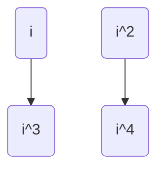
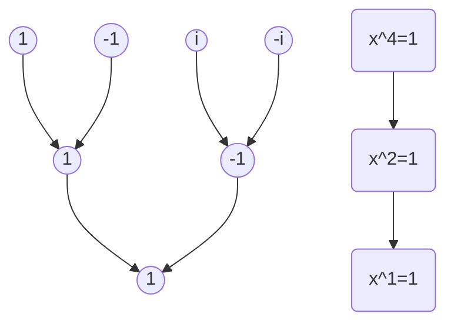

# FFT算法

FFT是上个世纪发明的最伟大的算法之一，这个算法不但在零知识证明中被使用（多项式乘法），在通信领域包括5G中也被使用。要理解这个算法，需要非常多的前置知识，我们不打算一步一步的推导这个算法。我们先来看一个具体的例子。

## 问题

有一个多项式：

$$A(x) = x^4 - x^3 - 2*x^2 + x - 1$$

还有一个多项式:

$$B(x) = x^4 - x^3 - x^2 - x + 1$$

让我们计算:

$$C(x) = A(x) * B(x)$$.

当然，最简单的方法就是，直接每项相乘，然后加和，不过这个算法复杂度是 $O(n^2)$.在零知识证明中，这个n的规模会非常大， $O(n^2)$会变得非常的低效。有没有更快的算法？

## 多项式知识

我们知道表示一个多项式，有两种表示方法，一种是通过系数表示，也就是上面的表示方法。还有一种表示方法是值表示法，就是上一篇文章说的，任意一个n次多项式，可以用n+1个点来确定。

如果，用点表示，那么乘法变的非常简单了.

A多项式的一个点:

$$(x_0, A(x_0))$$

B 多项式的一个点：

$$(x_0, B(x_0))$$

那么C(x) 的点就是:

$$(x_0, A(x_0) * B(x_0))$$

这样，在O(n)的复杂度就能求出乘法。不过，这个算法有一个很麻烦的问题，从多项式计算一个点，需要 $O(n)$，计算n点就需要 $O(n^2)$. 所以需要找到一个算法，可以快速的从多项式计算点的方法，同时还需要找到一个算法，快速的把多项式的点转换成系数。

我们来看最简单的情况. $A(x) = x^2$, 因为 $A(-x) = A(x)$, 这样计算 $A(x)$ 后， $A(-x)$ 就不需要计算了。减少了一半的计算量。那么有没有一种算法，几个根之间有更多的联系，可以用更快的算法全部求出。在实数域中，这样的值很难找，但是在复数域中，确实是可以找到的。我们知道 $A(x)=x^n - 1$ 有n个复数根，而且构成一个n阶的循环群。可以通过其中的一个生成元，生成所有的根，也就是说这些根之间是有很深刻的联系的，这些联系就是FFT的核心。

## 单位根的知识

单位根就是多项式 $A(x)=x^n-1$ 的n个根,我们知道这些根构成一个循环群，比如，4次的情况，生成元就是 $i$, $[i, i^2, i^3, i^4]$ 就是4个元素 $[i, -1, -i, 1]$。这些根的每个根都有相反的数字，也就是说存在任意一个元素 a, 存在 $-a$ .

引理1:

$$ x^{n/2} = -1 $$

我们知道，单位根均匀的分布在复平面的单位圆上，非常明显，这个圆的一半在坐标轴的-1的位置。

定理2:

$$ x^i = -x^{i+n/2} $$

$$ (-x^{i+n/2}) => (-1) * x^{n/2} * x^i => x^i $$

 对两个相反的数字，我们有 $(x^i)^2 = (x^{i+n/2})^2$, (很明显 $a^2 = (-a)^2$) 。简单的说, $[1,n/2]$ 和 $[n/2+1,n]$ 的平方和是对应相等。如下图所示：



如果我们把相反的数字放到一起，然后他们的平方是父节点，很明显，这些父节点就是 $x^{(n/2)}=1$ 的单位根, 而n/2 也是 2的幂次，还可以进行相同的递归下去，最后会回归到 $x^1 = 1$



从代数的角度来说， $x^4 = 1$ 有4个根，分别是 $[x_1, x_2, x_3, x_4]$, 然后这四个根分别做平方，也就是 $[x_1^2, x_2^2, x_3^2, x_4^2]$, 令 $y=x^2$, 那么这四个根的平方的解，就是 $x^4 = 1 => y^2 = 1$ 这里 $x_1^2 == x_3^2 == -1,x_2^2 == x_4^2 == 1$

单位根的这种树形递归的性质 就是 FFT 算法的核心点。

## FFT算法推导

我们用下面的多项式来举例说明:

$$A(x) = x^4 - x^3 - 2*x^2 + x - 1$$

 把奇数项和偶数项分开:

$$A(x) = (x^4 -2*x^2 -1) + x(-x^2 + 1)$$

这里我们变成了两个多项式，而且我们发现，令:

$$y=x^2$$

那么:

$$A(x) = (y^2 - 2y -1) + x(-y+1)$$
  
实际上，对于一个一般的多项式:

$$f(x)=a_{n-1}x^{n-1}+\cdots+a_1x+a_0$$

这里 $n = 2^k-1$ 加上常数项，这个多项式的系数刚好是 $n = 2^k$ . 然后把奇数项和偶数项分开:

$$f(x) = even(y) + xodd(y)$$

如果我们能求出 $even(y)$ 和 $odd(y)$, 那么就能求出 $f(x)$, 我们还可以用了一个技巧，进一步减少计算量.

因为：

$$x^2 = (-x)^2$$

所以：

$$f(-x) = even(y)-xodd(y)$$

因为每次降低一半的维度（ $y=x^2$ ），如果 $n=2^k-1$, 那么只要递归k次就能把问题解决。这个复杂度就从 $O(n^2)$ 变成了 $O(nlog_2n)$

这个算法可以根据多项式的系数，快速的求出 $f(x)$,  但是我们还需要一个算法，把点变成系数。这个问题看似和前面的算法是没有关系的，但是神奇的是，这居然是同一个问题。

## IFFT 逆快速傅立叶变换算法

在做逆快速傅立叶变换前，我们先把根的问题处理一下。对于单位根，我们知道是一个群。设生成元是 $\omega$, 那么n个元素就是: $[\omega^0, \omega^1, \omega^2, \cdots, \omega^{n-1}]$，$f(x)$ 也是一个数组 $[f(\omega^0), f(\omega^1), f(\omega^2), \cdots, f(\omega^{n-1})]$.  如果把系数和 $x，f(x)$ 都写出来就构成了一个方程组:

$$
\begin{bmatrix}
1 & 1 & 1 & \cdots & 1\\
1 & \omega & \omega^2 & \cdots & \omega^{n-1}\\
1 & \omega^2 & (\omega^2)^2 & \cdots & (\omega^2)^{n-1}\\
\vdots & \vdots & \vdots & & \vdots \\
1 & (\omega^{n-1}) & (\omega^{n-1})^2 & \cdots & (\omega^{n-1})^{n-1}\\
\end{bmatrix}
\begin{bmatrix}
a_0\\
a_1\\
\vdots \\
a_n\\
\end{bmatrix}=
\begin{bmatrix}
f(\omega^0) \\
f(\omega^1) \\
\vdots \\
f(\omega^{n-1})
\end{bmatrix}
$$

要求出系数，实际上是求一个逆矩阵：

$$
\begin{bmatrix}
1 & 1 & 1 & \cdots & 1\\
1 & \omega & \omega^2 & \cdots & \omega^{n-1}\\
1 & \omega^2 & (\omega^2)^2 & \cdots & (\omega^2)^{n-1}\\
\vdots & \vdots & \vdots & & \vdots \\
1 & (\omega^{n-1}) & (\omega^{n-1})^2 & \cdots & (\omega^{n-1})^{n-1}\\
\end{bmatrix}^{-1}
\begin{bmatrix}
f(\omega^0) \\
f(\omega^1) \\
\vdots \\
f(\omega^{n-1})
\end{bmatrix}=
\begin{bmatrix}
a_0\\
a_1\\
\vdots \\
a_n\\
\end{bmatrix}
$$

这个矩阵的求逆，在一般的教科书中都能找到，注意，这是一个复数的单位根的矩阵求逆。

$$
1/n
\begin{bmatrix}
1 & 1 & 1 & \cdots & 1\\
1 & \omega^{-1} & \omega^{-2} & \cdots & \omega^{-(n-1)}\\
1 & \omega^{-2} & (\omega^2)^{-2} & \cdots & (\omega^2)^{-(n-1)}\\
\vdots & \vdots & \vdots & & \vdots \\
1 & (\omega^{-(n-1)}) & (\omega^{n-1})^{-2} & \cdots & (\omega^{n-1})^{-(n-1)}\\
\end{bmatrix}
\begin{bmatrix}
f(\omega^0) \\
f(\omega^1) \\
\vdots \\
f(\omega^{n-1})
\end{bmatrix}=
\begin{bmatrix}
a_0\\
a_1\\
\vdots \\
a_n\\
\end{bmatrix}
$$

也就是说，正向变换和逆向变换就差了一个符号，同时多了一个  $1/n$。

最后是这个代码的go语言的实现:

```go
package main

import (
    "fmt"
    "math"
    "math/cmplx"
)

// FFT 实现
func FFT(a []complex128, invert bool) {
    n := len(a)
    if n == 1 {
        return
    }

    // 将数组分成偶数和奇数部分
    half := n / 2
    even := make([]complex128, half)
    odd := make([]complex128, half)
    for i := 0; i < half; i++ {
        even[i] = a[i*2]
        odd[i] = a[i*2+1]
    }

    // 递归调用 FFT
    FFT(even, invert)
    FFT(odd, invert)

    // 计算 FFT
    angle := 2 * math.Pi / float64(n)
    if invert {
        angle = -angle
    }
    w := complex(1, 0)
    wn := cmplx.Exp(complex(0, angle))
    for i := 0; i < half; i++ {
        a[i] = even[i] + w*odd[i]
        a[i+half] = even[i] - w*odd[i]
        if invert {
            a[i] /= 2
            a[i+half] /= 2
        }
        w *= wn
    }
}

// 多项式乘法
func multiplyPolynomials(a, b []complex128) []complex128 {
    n := 1
    for n < len(a)+len(b) {
        n <<= 1
    }
    a = append(a, make([]complex128, n-len(a))...)
    b = append(b, make([]complex128, n-len(b))...)

    FFT(a, false)
    FFT(b, false)

    for i := range a {
        a[i] *= b[i]
    }

    FFT(a, true)
    return a
}

func main() {
    a := []complex128{1, 2, 3, 4}
    b := []complex128{1, 2, 3, 4}

    result := multiplyPolynomials(a, b)
    for _, v := range result {
        fmt.Printf("%.0f ", real(v))
    }
}
```
