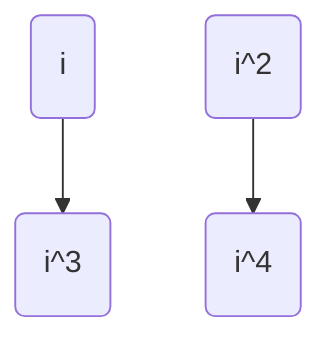
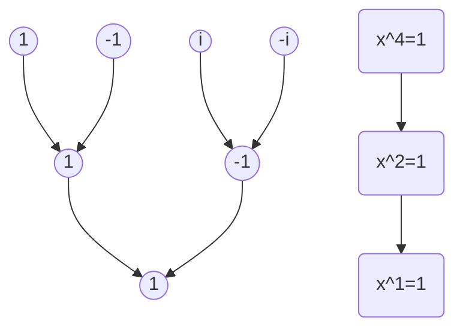

# FFT算法

FFT是上个世纪发明的最伟大的算法之一，这个算法不但在零知识证明中被使用，在通信领域包括5G中也被使用。要理解这个算法，需要非常多的前置知识，我们先来看他解决的一个问题，多项式的乘法。我们先来看一个具体的例子。

有一个多项式 $A(x) = x^4 - x^3 - 2*x^2 + x - 1$, 还有一个多项式 $B(x) = x^4 - x^3 - x^2 - x + 1$ , 让我们计算 $C(x) = A(x) * B(x)$.

当然，最简单的方法就是，直接每项相乘，然后加和，不过这个算法复杂度是 $O(n^2)$.有没有更快的算法？
我们知道表示一个多项式，有两种表示方法，一种是通过系数表示，也就是上面的表示方法，还有一种表示方法是值表示法，就是上一篇文章说的，任意一个n次多项式，可以用n+1个点来确定。如果，用点表示，那么乘法变的非常简单了. $(x_0, A(x_0)), (x_0, B(x_0))$, 那么C(x) 的点就是 $(x_0, A(x_0) * B(x_0))$ 这样，在O(n)的复杂度就能求出乘法。不过，这个算法有一个很麻烦的问题，从多项式计算一个点，需要n，计算n点就需要 $O(n^2)$. 所以需要找到一个算法，可以快速的从多项式计算点的方法。我们来看最简单的情况. $A(x) = x^2$, 因为 $A(-x) = A(x)$, 这样计算 $A(x)$ 后， $A(-x)$ 就不需要计算了。减少了一半的计算量。那么有没有一种算法，几个根之间有更多的联系，可以用更快的算法全部求出。在实数域中，这样的值很难找，但是在复数域中，确实是可以找到的。我们知道 $A(x)=x^n - 1$ 有n个复数根，而且构成一个n阶的循环群。可以通过其中的一个生成元，生成所有的根，也就是说这些根之间是有很深刻的联系的。

## 单位根的研究

单位根就是多项式 $A(x)=x^n-1$ 的n个根，我们假设n 是2的幂次，比如说是 4，那么就有一个非常有趣的性质。
我们知道这些根构成一个循环群，4次的情况，生成元就是 $i$, $[i, i^2, i^3, i^4]$ 就是4个元素 $[i, -1, -i, 1]$。我们发现一个问题，对2的幂次的单位根，如果 $x^n = 1$, 那么 $x^{n/2} = -1$, 也就是说 $x^i$ 和 $x^{i+n/2}$ 是两个相反的数字。对两个相反的数字，我们有 $(x^i)^2 = (x^{i+n/2})^2$, (很明显 $a^2 = (-a)^2$) 。简单的说, $[1,n/2]$ 和 $[n/2+1,n]$ 的平方和是对应相等。如下图所示：

如果我们把相反的数字放到一起，然后他们的平方是父节点，很明显，这些父节点就是 $x^{(n/2)}=1$ 的单位根, 而n/2 也是 2的幂次，还可以进行相同的递归下去，最后会回归到 $x^1 = 1$

从代数的角度来说， $x^4 = 1$ 有4个根，分别是 $[x_1, x_2, x_3, x_4]$, 然后这四个根分别做平方，也就是 $[x_1^2, x_2^2, x_3^2, x_4^2]$, 令 $y=x^2$, 那么这四个根的平方的解，就是 $x^4 = 1 => y^2 = 1$ 这里 $x_1^2 == x_3^2 == -1,x_2^2 == x_4^2 == 1$

单位根的这种树形递归的性质 就是 FFT 算法的核心点。

## FFT算法

