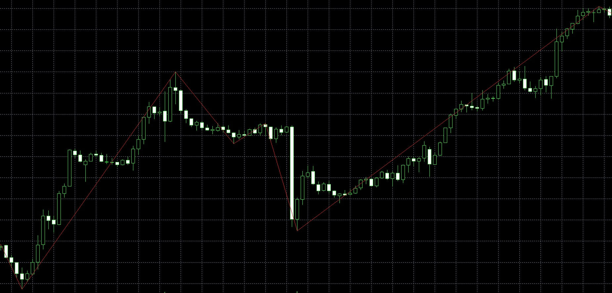

# zigzag 指标详解

zigzag 指标主要的目标是，把K线图的小波动去除，只留下大的波动，这样更加利于分析整体的趋势。

如图所示，就是一个zigzag指标



通过对K线zigzag化，有利于机器学习算法抓住趋势的一些本质，寻找到判断趋势的一些规律。这篇文章主要讲述如何实现一个简单的zigzag指标。

## 整体的思路

1. 寻找到k线到所有高点和低点，用 (index, price, type) 结构表示。type 有High 和 Low 两个选项。

2. 用index 排序所有的结构，合并掉次高点和次低点，使得整个结构变成高低点交错的结构。

3. 连接这些高点低，就是zigzag的图形。

在mql5中，这个实现有一些不同，他没有采用结构体结构，而是用一个 HighBuffer 和 一个LowBuffer 表示高低点，然后在计算过程中，动态的去决定 type 是 High 还是 Low。

## mql5 的实现

```mql5
int OnCalculate(const int rates_total, const int prev_calculated, const datetime &time[],
                const double &open[], const double &high[], const double &low[], const double &close[],
                const long &tick_volume[], const long &volume[], const int &spread[])
{
    int i=0;
    int limit=0,counterZ=0,whatlookfor=0;
    int shift=0,back=0,lasthighpos=0,lastlowpos=0;
    double val=0,res=0;
    double curlow=0,curhigh=0,lasthigh=0,lastlow=0;

    enum looling_for { Pike=1, Sill=-1 };

    if(prev_calculated==0)
    {
        ArrayInitialize(ZigzagBuffer,0.0);
        ArrayInitialize(HighMapBuffer,0.0);
        ArrayInitialize(LowMapBuffer,0.0);
    }

    if(rates_total<100) return(0);

    if(prev_calculated==0) limit=ExtDepth;

    if(prev_calculated>0)
    {
        i=rates_total-1;
        while(counterZ<level && i>rates_total-100)
        {
            res=ZigzagBuffer[i];
            if(res!=0) counterZ++;
            i--;
        }
        i++;
        limit=i;

        if(LowMapBuffer[i]!=0)
        {
            curlow=LowMapBuffer[i];
            whatlookfor=Pike;
        }
        else
        {
            curhigh=HighMapBuffer[i];
            whatlookfor=Sill;
        }

        for(i=limit+1;i<rates_total && !IsStopped();i++)
        {
            ZigzagBuffer[i]=0.0;
            LowMapBuffer[i]=0.0;
            HighMapBuffer[i]=0.0;
        }
    }

    for(shift=limit;shift<rates_total && !IsStopped();shift++)
    {
        val=low[iLowest(low,ExtDepth,shift)];
        if(val==lastlow) val=0.0;
        else
        {
            lastlow=val;
            if((low[shift]-val)>deviation) val=0.0;
            else
            {
                for(back=1;back<=ExtBackstep;back++)
                {
                    res=LowMapBuffer[shift-back];
                    if((res!=0) && (res>val)) LowMapBuffer[shift-back]=0.0;
                }
            }
        }
        if(low[shift]==val) LowMapBuffer[shift]=val; else LowMapBuffer[shift]=0.0;

        val=high[iHighest(high,ExtDepth,shift)];
        if(val==lasthigh) val=0.0;
        else
        {
            lasthigh=val;
            if((val-high[shift])>deviation) val=0.0;
            else
            {
                for(back=1;back<=ExtBackstep;back++)
                {
                    res=HighMapBuffer[shift-back];
                    if((res!=0) && (res<val)) HighMapBuffer[shift-back]=0.0;
                }
            }
        }
        if(high[shift]==val) HighMapBuffer[shift]=val; else HighMapBuffer[shift]=0.0;
    }

    if(whatlookfor==0)
    {
        lastlow=0;
        lasthigh=0;
    }
    else
    {
        lastlow=curlow;
        lasthigh=curhigh;
    }

    for(shift=limit;shift<rates_total && !IsStopped();shift++)
    {
        res=0.0;
        switch(whatlookfor)
        {
            case 0:
                if(lastlow==0 && lasthigh==0)
                {
                    if(HighMapBuffer[shift]!=0)
                    {
                        lasthigh=high[shift];
                        lasthighpos=shift;
                        whatlookfor=Sill;
                        ZigzagBuffer[shift]=lasthigh;
                        res=1;
                    }
                    if(LowMapBuffer[shift]!=0)
                    {
                        lastlow=low[shift];
                        lastlowpos=shift;
                        whatlookfor=Pike;
                        ZigzagBuffer[shift]=lastlow;
                        res=1;
                    }
                }
                break;
            case Pike:
                if(LowMapBuffer[shift]!=0.0 && LowMapBuffer[shift]<lastlow && HighMapBuffer[shift]==0.0)
                {
                    ZigzagBuffer[lastlowpos]=0.0;
                    lastlowpos=shift;
                    lastlow=LowMapBuffer[shift];
                    ZigzagBuffer[shift]=lastlow;
                    res=1;
                }
                if(HighMapBuffer[shift]!=0.0 && LowMapBuffer[shift]==0.0)
                {
                    lasthigh=HighMapBuffer[shift];
                    lasthighpos=shift;
                    ZigzagBuffer[shift]=lasthigh;
                    whatlookfor=Sill;
                    res=1;
                }
                break;
            case Sill:
                if(HighMapBuffer[shift]!=0.0 && HighMapBuffer[shift]>lasthigh && LowMapBuffer[shift]==0.0)
                {
                    ZigzagBuffer[lasthighpos]=0.0;
                    lasthighpos=shift;
                    lasthigh=HighMapBuffer[shift];
                    ZigzagBuffer[shift]=lasthigh;
                }
                if(LowMapBuffer[shift]!=0.0 && HighMapBuffer[shift]==0.0)
                {
                    lastlow=LowMapBuffer[shift];
                    lastlowpos=shift;
                    ZigzagBuffer[shift]=lastlow;
                    whatlookfor=Pike;
                }
                break;
            default: return(rates_total);
        }
    }

    return(rates_total);
}
```

## 流程图

### 初始化

```Mermaid
graph TB
    A[Start] --> B[SetIndexBuffer for ZigzagBuffer]
    B --> C[SetIndexBuffer for HighMapBuffer]
    C --> D[SetIndexBuffer for LowMapBuffer]
    D --> E[PlotIndexSetString]
    E --> F[IndicatorSetInteger]
    F --> G[PlotIndexSetDouble]
    G --> H[Calculate Deviation]
    H --> I[Return INIT_SUCCEEDED]
    I --> J[End]
```

### 搜索最高点和最低点

```Mermaid
graph TB
    A[Start iHighest/iLowest] --> B[Initialize index]
    B --> C[Validate startPos]
    C --> D[Initialize max/min]
    D --> E[For loop from startPos to startPos-depth]
    E --> F[Update index if new max/min found]
    F --> G[Return index]
    G --> H[End]
```

### 核心逻辑

```Mermaid
graph TB
    A[Start OnCalculate] --> B[Initialize variables]
    B --> C[Check rates_total < 100]
    C --> D{prev_calculated == 0}
    D -->|Yes| E[Initialize Buffers]
    E --> F[Set limit to ExtDepth]
    D -->|No| G[Calculate from last unfinished bar]
    G --> H[Determine extremum type]
    H --> I[Clear Buffers]
    I --> J[For loop to search High and Low]
    J --> K{What to look for}
    K -->|0| L[Search for peak or valley]
    K -->|Pike| M[Search for peak]
    K -->|Sill| N[Search for valley]
    L --> O[Update Buffers and Zigzag]
    M --> O
    N --> O
    O --> P[Return rates_total]
    P --> Q[End]
```