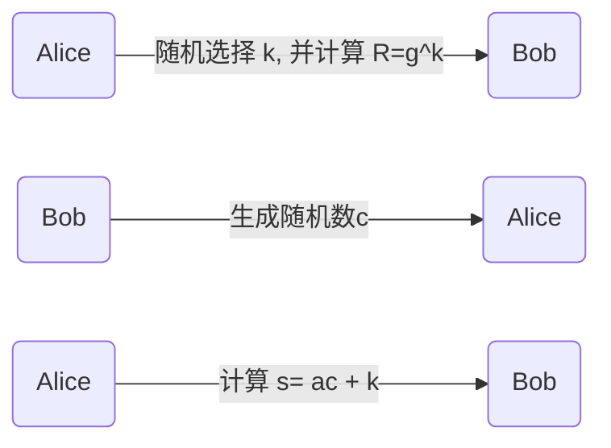
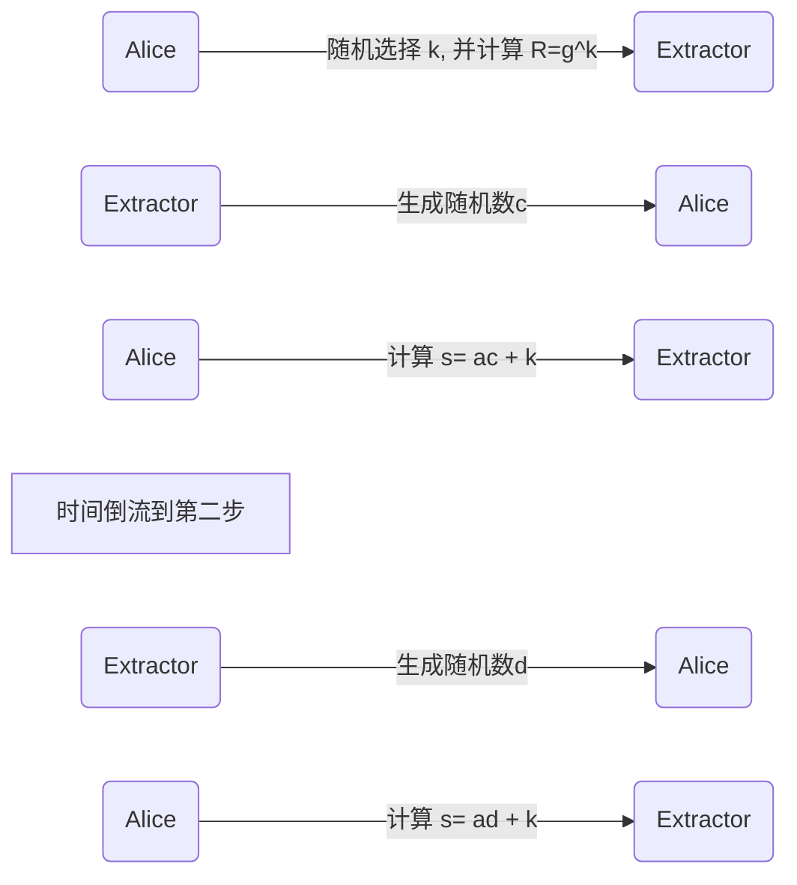
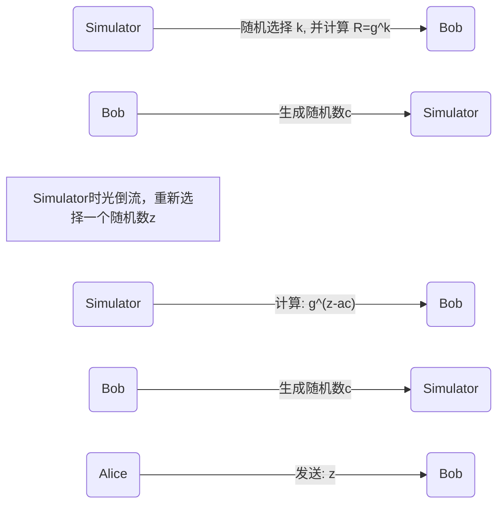
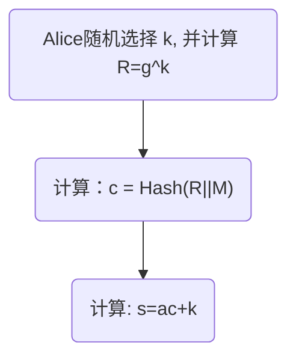
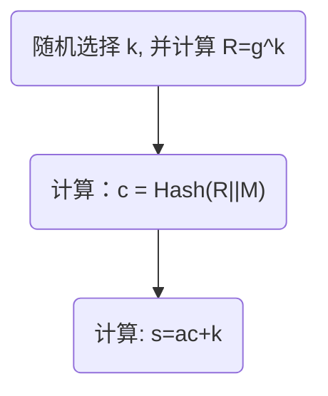

# 理解零知识证明

有大量的文章解释零知识证明，但是和大部分一样，我看了一些文章后，除了知道了几个概念，我无法非常形象具体的去理解零知识证明。大部分文章中，都会介绍，零知识证明需要满足三个属性:

```
完整性：如果证明者是诚实的，那么她最终会说服验证者。
健全性：只有陈述属实，证明者才能说服验证者。
零知识：验证者除了知道该陈述是真实的之外，没有得到任何其他信息。
```

到底什么是完整性，什么是健全性，什么是零知识，好像都非常的抽象。就像我知道，这只鸟叫做布谷鸟，但是，我不知道他的任何习性，任何特点，他只是有个名字叫做布谷鸟。甚至，叫abc鸟，我们对这种鸟的理解也是一样的。这篇文章试图从一个实际的例子来理解零知识证明和他对应的属性。

## 问题

在一个椭圆曲线中，Alice 有一个私钥，他公开了一个公钥 $P$ ，然后他要向全世界的人证明他拥有私钥。当然，最简单的证明就是他公开私钥，然后用椭圆曲线的生成器  $g$ 计算公钥: $g^a$ 其中 $a$ 是的私钥，这样如果 $P=g^a$ 那么就能证明Alice 确实知道这个私钥。但是这个证明不是零知识的，也就是说，他公开了知识来获得了一个证明，这个是最简单的你证明你拥有知识的方法。困难的是如何不公开知识也能获得证明，这个问题的意义就是，如果你能不泄漏任何知识进行证明，那么你就可以一直使用这个私钥，而不用每次都换一个私钥。

### 协议

Alice如何零知识的证明他拥有私钥，协议如下:



s 发送给Bob后，Bob进行如下的验证:

计算: $A=g^s$

计算: $B=P^cR$

验证: $A == B$

A == B 如果成立，那么我们就认为Alice 拥有私钥。而且我们可以发现 s, P, c, R 都是已知的数据，c还是Bob提供的。可以很容易证明：

$$
g^s = g^{(ac+k)} = g^{ac}g^k = (g^a)^cR = P^cR
$$

也就是说，如果Alice 是否提供了诚实的 s , 那么我们可以通过计算 A == B 来验证

### 健全性

很明显，s的计算用了私钥。但是，这是针对诚实的Alice , 或者没有超能力的Alice，后面我们会介绍一个拥有超能力的Alice，他可以构造出 Bob 可以验证 A==B，但是没有使用 s。 我们需要用一种通用的办法来证明。在零知识证明系统中，证明健全性的方法就是采用知识提取器。当然，这个知识提取器在正常的协议下肯定是无法存在的，如果能提取出知识，那么就不是零知识证明了。

如果我们能够通过知识提取器提取出私钥，那么，就可以证明Alice 如果没有a，是无法构造出证明的，当然不符合协议的，有超能力的Alice可以构造出，在正常协议下，不管Alice 是否恶意，都无法构造出证明。

知识提取的流程如下:



通过时间倒流，extractor 可以欺骗Alice 用相同的k 生成了两个s。如下图:

$$
s1 = ac +k
$$

$$
s2 = ad +k
$$

解方程:

$$
a=(s1-s2)/(c-d)
$$

这样，就可以证明确实 s 中是存在 a 这个私钥的。

现实中，如果Alice 用了一个不太随机的随机数，不小心，把两次证明的 k 弄成相同了，那么Alice 就会泄漏私钥。

### 零知识

下面我们需要证明零知识。证明零知识的方法也很简单，那就是让一个拥有超能力的机器，按照协议生成数据，他可以完美验证者，因为这个机器不知道私钥，只是有些超能力（没有获取私钥的超能力），这样我们就可以证明，确实Alice提供的"证明"是零知识的。这个有超能力的机器 和 上面的 知识提取器一样，同样都有时间倒流的超能力，我们来看流程：



Simulator 通过一个时光穿梭机，知道了Bob 要出什么随机数，这样他就可以构造出一个证明，骗过Bob。注意 g^(z-ac) 的计算不需要 知道a，计算方法如下：

$$
g^{z-ac} = g^z * (g^a)^{-c} = g^z * P^{-c}
$$

通过公钥就能计算出来。

我们来看Bob 如何验证:

计算: $A=g^s$

计算: $B=P^cR$

$$
A=g^z
$$

$$
B=P^c*g^{z-ac} = g^{ac} * g^{z-ac} = g^z
$$

好了，果然 A == B, Simulator 成功欺骗了Bob，但是Simulator确实没有任何私钥的知识，这样的情况下，就证明没有知识，也可以让Bob证明成功。正常流程下，不存在Simulator这种可以时空穿梭的机器，所以，没有私钥无法构造证明，但是，这证明了，证明中不存在任何私钥的知识。所以，实际上这个有两个概念，构造证明需要用到私钥或者说知识，但是无法从证明中提取任何知识，这个就是零知识证明的本质

理解了零知识证明的两个核心: 健全性 和 零知识。一个要证明“证明”中包含知识，一个要证明“证明”中没有泄漏知识。这两个东西看似矛盾，实际上，这两个模拟器在现实中都不会存在，所以看上去时矛盾的。因为能计算出私钥，所以，生成的“证明”是包含私钥的元素的，没有私钥时无法伪造的（除了模拟器），也就是说生成证明必须用到私钥。同时，虽然包含了私钥，但是没有泄漏任何知识的，也就是说正常的知识提取器是无法提取任何知识的。

### 非交互式证明

交互式证明需要两个用户在线的情况，而且，证明只在这两个用户之间有效，其他用户不知道交互的双方是否互相勾结。在区块链中，我们需要向全网络证明。我们知道，如果证明者事先知道了随机数c， 那么，他可以变成一个 Simulator。

step1: 计算
$$
R = g^{z-ac} = g^z * P^{-c}
$$

step2: 计算

$$
s = z
$$

这样就可以伪造出（R, s）, 这个就是一个符合要求的签名。为了让用户无法随意的构造R，必须通过一个hash函数，让用户确定了R之后，c也对应的确定了。这样就不能通过c 去构造R 了，因为R一改变，c 同时也会改变。

非交互式协议如下：



让模拟器无法伪造R 的办法就是 c=Hash(R||M), R变化了之后，c也会跟着改变，这样陷入了死循环，模拟器只能暴力的去凑数，而这个和去猜私钥是多少的难度也差不多了。

### 对比 Schnorr 签名

Schnorr 签名的流程:



我们发现Schnorr 签名 就是非交互式的零知识证明，所以，签名可以看作是一种零知识证明。理解起来其实也非常简单，那就是私钥的拥有者要全网证明他有私钥，要进行一些操作，但是，这些证明不包含私钥相关的知识。
