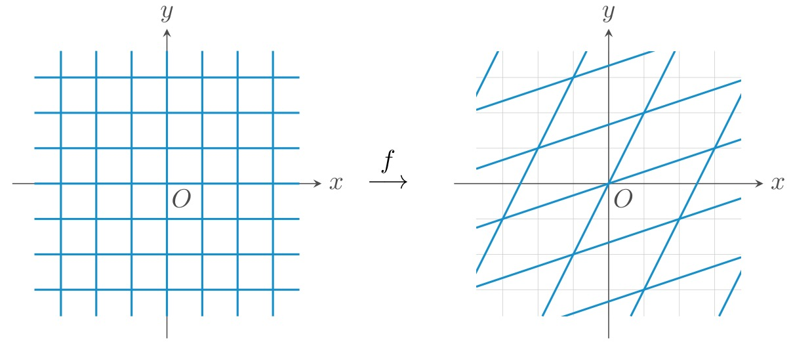

# 双线性映射

## 什么是线性映射

线性映射是线性代数的主要研究对象。在线性代数中，线性映射是两个向量之间的映射。

$$
f: R^2 \rightarrow R^2
$$

$$
(x, y)\mapsto(3x+y, x+2y)
$$

一般的, 线性映射涉及两种运算: 加法和数乘

$$
f(x+y) = f(x) + f(y)
$$

$$
f(ax) = af(x)
$$

其中 x, y 是向量，a 是一个数字。

从几何角度来说，一个线性映射就是对网格进行了拉伸，旋转，但是没有进行扭曲。

## 线性变换与矩阵乘法

$$
\begin{pmatrix}
1 & 2 \\
3 & 4
\end{pmatrix}
\begin{pmatrix}
x \\
y
\end{pmatrix}=x
\begin{pmatrix}
1 \\
3
\end{pmatrix}+y
\begin{pmatrix}
1 \\
3
\end{pmatrix}=
\begin{pmatrix}
1x+2y \\
3x+4y
\end{pmatrix}
$$

这样通过矩阵乘法，我们实现了一个线性映射：

$$
f: R^2 \rightarrow R^2
$$

$$
(x, y)\mapsto(1x+2y, 3x+4y)
$$

## 如何证明一个变换是线性变换

需要证明两个公式:

1. 
$$
f(ax) = af(x)
$$

2.
$$
f(x+y) = f(x) + f(y)
$$

我们发现用矩阵表示的变换都符合线性变换的要求。

$$
\begin{aligned}
f(x) = Ax \\
f(ax) = A(ax) = aAx = af(x) \\
f(x+y) = A(x+y) = Ax + Ay = f(x) + f(y) \\
\end{aligned}
$$

## 什么是双线性映射

线性变换是一个一维的函数，这个问题可以推广到二维的情况。

$$
\begin{aligned}
f(A, B + C) = f(A, B) + f(A, C) \\
f(A+B, C) = f(A, C) + f(B, C)
\end{aligned}
$$

可以推导出:

$$
\begin{aligned}
f(A, nB) = nf(A, B) \\
f(nA, C) = nf(A, C)
\end{aligned}
$$

保持A不变的时候，变量B就是一个线性变换，同时保持变量B不变的时候，变量A就是一个线性变换。

## 线性变换的推广

$$
f(x+y) = f(x)*f(y)
$$

我们刚刚到线性变换，运算符号是相同的，都是加法，实际上可以推广到运算符号不同的情况

### 例子：

$$
f(x+y) = e^{x+y} = e^x * e^y = f(x) * f(y)
$$

$$
f(ax) = e^{ax} = (e^x)^a = f(x)^a
$$

## 线性变换的本质

我们发现，线性变换的本质实际上是同态：

$$
f(x+y) = f(x)*f(y)
$$

## 同态映射的例子

我们有两个旋转群 $R_4$ 和  $R_2$, $R_4$  有4个元素 $(0, 90, 180, 270)$, R_2 有两个元素 $(0, 180)$, 我们建立一个映射:

$$
(0, 180) \mapsto 0
$$

$$
(90, 270) \mapsto 180
$$

现在我们验证同态:

$$
\begin{aligned}
f(0+90) = f(0) + f(90) = 0 + 180  \mapsto 180 \\
f(180+270) = f(90) \mapsto 180 \\
f(180) + f(270) = 0 + 180 \mapsto 180
\end{aligned}
$$

同态不一定是一一对应的，有时候很多个元素会映射到同一个元素。

## 总结

线性代数里面的线性映射实际上就是同态映射，密码学中经常用的双线性映射也是同态中的一种。当然，密码学中的同态，不能是这种简单的线性映射，必须是一种不可逆的映射。