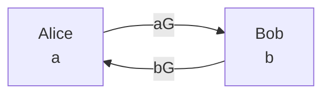
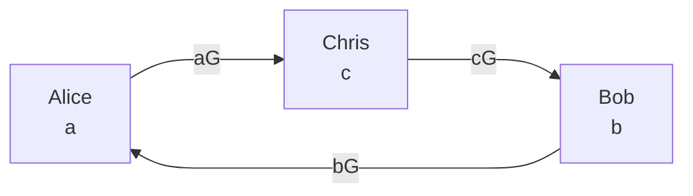
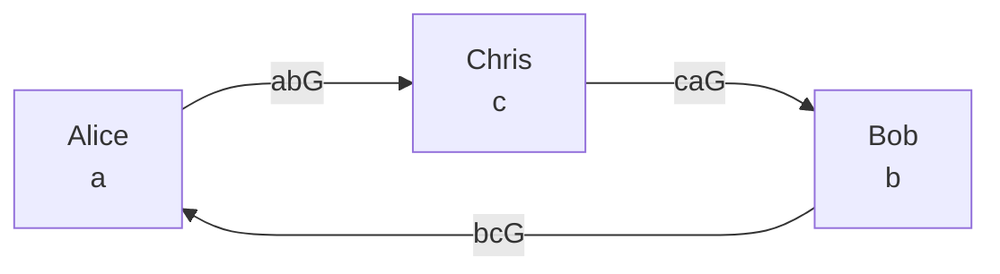
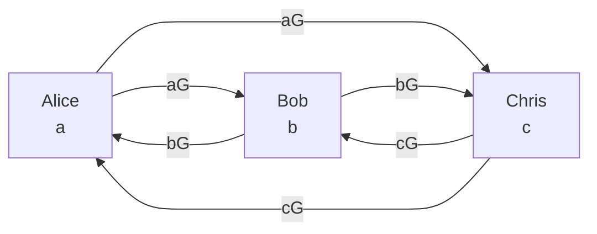

# 多方DH交换问题

## 1. 什么是DH交换

迪菲-赫尔曼密钥交换（英语：Diffie–Hellman key exchange，缩写为D-H） 是一种安全协议。它可以让双方在完全没有对方任何预先信息的条件下通过不安全信道建立起一个密钥。这个密钥可以在后续的通讯中作为对称密钥来加密通讯内容。公钥交换的概念最早由瑞夫·墨克（Ralph C. Merkle）提出，而这个密钥交换方法，由惠特菲尔德·迪菲（Bailey Whitfield Diffie）和马丁·赫尔曼（Martin Edward Hellman）在1976年首次发表。马丁·赫尔曼曾主张这个密钥交换方法，应被称为迪菲-赫尔曼-墨克密钥交换（英语：Diffie–Hellman–Merkle key exchange）这个方法被发明后不久出现了RSA，这个方法对RSA的发明是有启发性的。现在我们日常用的tls握手协议中，就有DH交换的算法。

## 2. DH算法的实现

下图是DH算法的流程图

G是一个椭圆曲线的生成元，a是Alice 的私钥，b是Bob的私钥。aG 就是Alice的公钥，而bG就是Bob的公钥。Alice 得到bG后，计算 a(bG)的值，Bob得到 aG后，计算 b(aG) 的值。椭圆曲线群是一个交换群，所以abG = baG，这个就是私钥。

## 3. 三方DH交换

对三方DH交换来说，G是一个椭圆曲线的生成元，a是Alice 的私钥，b是Bob的私钥，c是Chris的是私钥。aG 就是Alice的公钥，而bG就是Bob的公钥，cG是Chris的公钥。我们要让他们分享 abcG这个密钥，那么需要两步才能完成。首先是分享 aG, bG, cG, 然后是分享: abG, acG, bcG, 通过这三个，alice, bob 和 chris就可以计算出 abcG，当然这个方法又个缺点，需要两轮通信才能完成，如果是tls这样的协议来说，这会大大增加延时。两轮通信的上方DH交换流程图如下：

第一轮

第二轮

这样Alice , Bob, Chris 都能计算出 abcG了。

这里有个问题，就是已知 aG 和 bcG，能不能求出abcG，如果这个能求出，那么这个协议不安全，因为在通信过程中 aG 和 bcG 都是可以被劫持的。实际上这个问题和 知道 aG 和 bG 能不能求出 abG是一样的。我们知道这是一个加法群，所以有 aG + bG = (a+b)G, 是没有办法进行乘法运算的。所以无论怎么运算，都不可能实现abG.

## 一轮三方DH交换

在2000年以前，这个问题是无法实现的。直到椭圆曲线配对的提出。详细介绍椭圆曲线配对的算法超出了本文的范围，但是你可以简单的认为，椭圆曲线配对引入了乘法，也就是已知 aG 和 bG 虽然不能直接求出 abG, 但是可以求出另外一个群  $G_T$  中求出 $abG_T$. 下面是一轮三方DH交换流程图：

在说计算方法之前，我们先说双线性映射的计算公式:

$$e(P, Q+R) = e(P, Q) \cdot e(P, R)$$
$$e(P+Q, R) = e(P, R) \cdot e(Q, R)$$

e就是一个算线性映射函数，在大部分情况下，我们可以认为这是一个黑盒，不用管具体怎么计算e这个函数，不知道里面的细节不影响我们理解算法的本质。

可以推出：

$$ e(aG, bQ) = e(G,G)^{ab}$$

这里，乘法用加法展开，然后用双线性公式就可以推导出来。对chirs来说，aG, bG, 知道后，就可以计算出: e(aG,bG)^{ab} 之后，我们就可以计算出: $e(G,G)^{ab}$.然后$(e(G,G)^{ab})^c$, 这样就能计算出: $e(G,G)^{abc}$, 同样Bob 和 Alice也可以计算出来，这样一轮就能实现三方的DH交换。