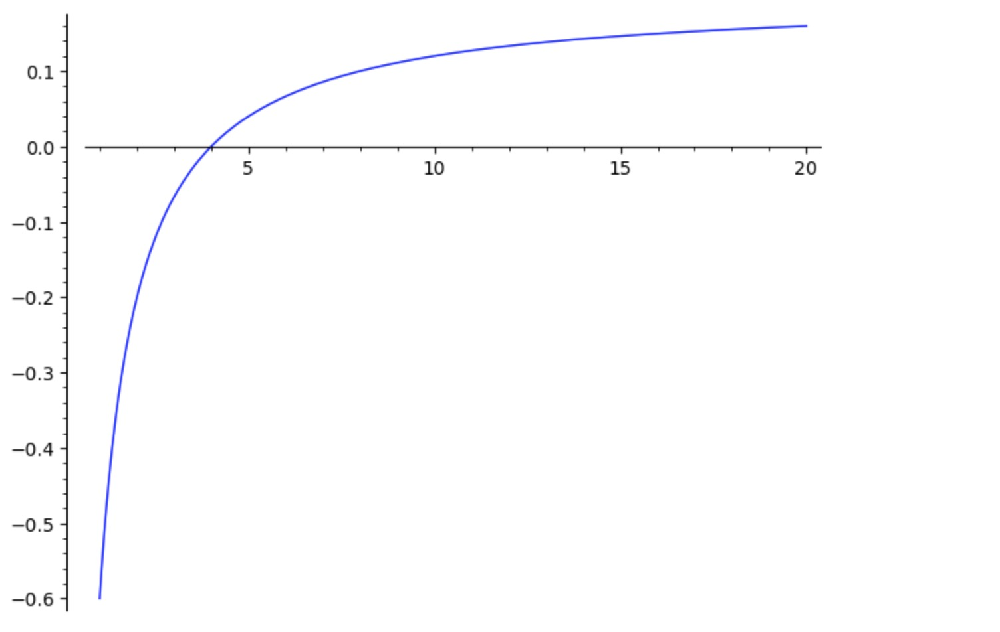
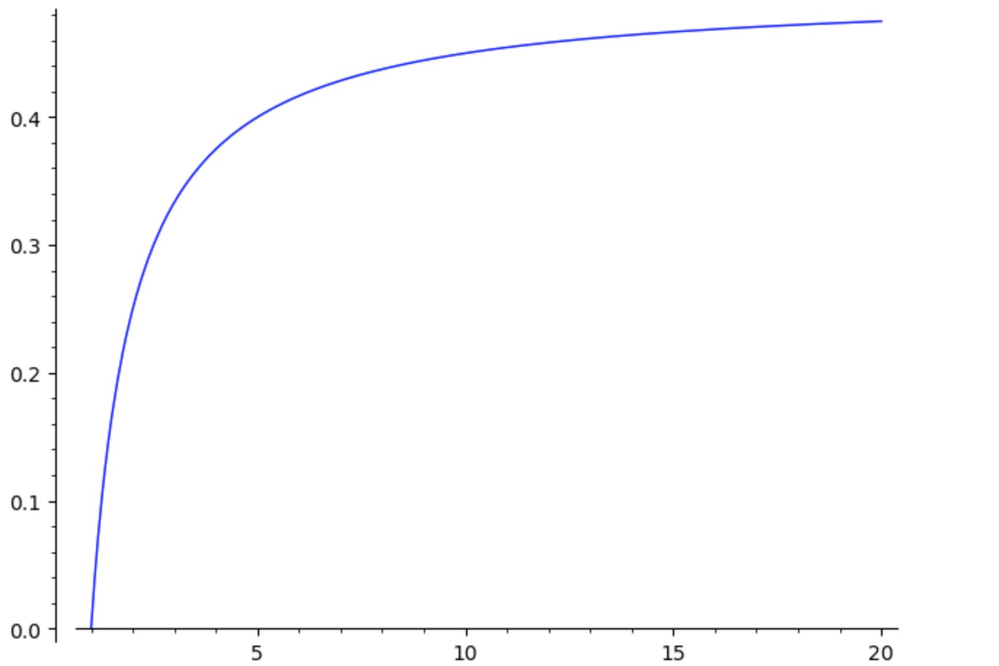
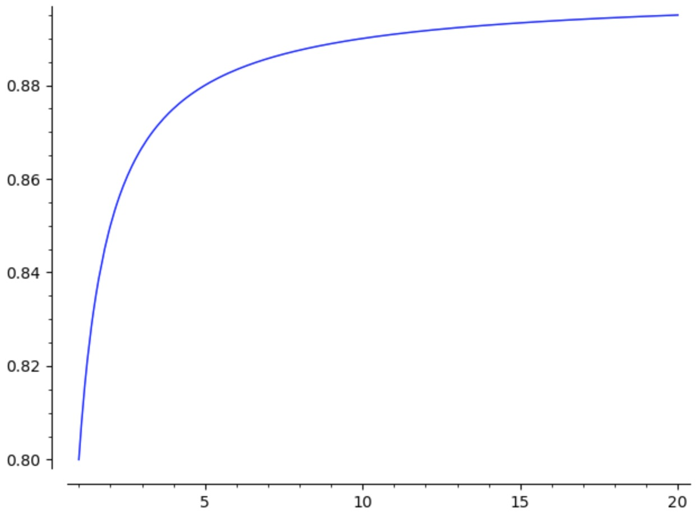

# 概率与炒股

## 背景

最近A股人气很旺，盘面上也是暴涨暴跌。很多新手，冲进去直接就亏损20%，情绪也受到了影响。对在股市中赚钱的人，大部分其实也不是因为真的能预测涨跌的概率，而是，仅仅是因为运气好，只有长期能赚钱的人，才是拥有与常人不一样的对股市的洞察。这篇文章，主要是为新手写的，我主要讲一些新手都需要了解的常识问题，因为研究表明，一只对股票一无所知的猴子，都要比正常的人更加有概率盈利，因为市场会利用人性的弱点，会让人上当。这篇文章，主要分析两个问题：

1. **什么情况下买入**
2. **一次买入多少**

## 凯利公式

解决什么情况下买入的问题比较复杂，我们先解决，如果你要买入，需要买入多少量的问题。很多新手一上来就是梭哈，这当然是一种英勇无畏的态度，但是这很容易让你完全失去本金，而无法翻身。很多人听过一个公式叫做凯利公式，这个公式实际上就是解决买入多少量的问题的。

凯利公式（Kelly Formula）是一种用于确定在投资或赌博中最佳投注比例的数学公式。它由约翰·拉里·凯利（John Larry Kelly）在1956年提出，最初用于电信领域，但后来被广泛应用于金融投资和赌博中。凯利公式的核心思想是通过最大化长期资本增长率来确定最佳的投注比例。

### 凯利公式的基本形式

凯利公式的基本形式如下：

$$ f^* = \frac{bp - q}{b} $$

其中：

- $f^*$ 是建议的投注比例（即你应该投入总资本的百分比）。
- $b$ 是赔率减去1（例如，如果赔率是3:1，那么 $b = 2$）。
- $p$ 是获胜的概率。
- $q$ 是失败的概率（即 $1 - p$）。

### 凯利公式的应用

凯利公式可以帮助投资者或赌徒确定在每次投资或赌注中应该投入多少资金，以最大化长期资本增长。以下是一个简单的例子：

假设你在一个赌局中，赔率是2:1（即 \( b = 1 \)），你认为获胜的概率是60%（即 \( p = 0.6 \)），那么失败的概率是40%（即 \( q = 0.4 \)）。将这些值代入凯利公式：

$f^* = \frac{1 \cdot 0.6 - 0.4}{1} = 0.2$

这意味着你应该投入总资本的20%来进行这次赌注。

### 凯利公式的优点

1. **最大化长期增长**：凯利公式通过最大化长期资本增长率，帮助投资者在长期内获得最大的收益。
2. **风险管理**：凯利公式考虑了风险和回报的平衡，避免了过度冒险。

### 凯利公式的局限性

1. **准确的概率估计**：凯利公式依赖于对获胜概率的准确估计。如果概率估计不准确，公式的结果可能会误导投资决策。
2. **市场波动**：在金融市场中，价格波动和市场条件的变化可能会影响凯利公式的适用性。

下面我取p=0.2,0.5,0.9 这3个数字，然后看看有多少赔率，我们可以去投资。

p=0.2 b=(1, 20)，我们发现，如果我们以小博大，比如20%的概率，能赚5倍收益，那么如果投入资金只能是4%



p=0.5 b=(1, 20), 取b=1.5，那么我们应该投入 16%



p=0.9 b=(0.1, 20)




## 买入时机问题

对股票来说，实际上就是两个问题：什么时候买入，什么时候卖出。简单的说，就是在上涨概率大的情况下买入，在下跌概率大的情况下卖出。但是很多新手会认为上涨概率大于50%就可以买入，下跌概率大于50%就可以卖出。实际上，概率不是唯一决定的要素。让我们举个最简单的例子，很多人喜欢买彩票，彩票中大奖的概率非常非常低，为了什么很多人还是很愿意买入呢，实际上还有一个决定要素就是回报。实际上，很多研究表明，股票在微观上实际上是一种随机游走，也就是说，如果取很短的时间，比如，一秒钟后的行情，他基本上是满足正态分布的，也就是上涨和下跌的概率都是50%，但是一秒内的波动概率都非常小，所以概率大差别就不是非常明显，但是，如果时间尺度放大到一天，一周，一年，他的上涨和下跌概率不会再相等了。所以，你买入一个股票，决定要素有两个，一个是概率，一个是一定时间内的回报。


凯利公式的推导过程涉及到最大化长期资本增长率的数学原理。以下是详细的推导过程：

### 1. 定义变量

假设你有一个初始资本 \( W \)，每次投注的比例为 \( f \)，获胜的概率为 \( p \)，失败的概率为 \( q = 1 - p \)，获胜时的赔率为 \( b \)，失败时的损失比例为 \( r \)。

### 2. 计算每次投注后的资本

- 如果获胜，资本变为 \( W(1 + bf) \)。
- 如果失败，资本变为 \( W(1 - rf) \)。

### 3. 计算长期资本增长率

长期资本增长率可以通过几何平均增长率来表示。假设进行 \( n \) 次独立投注，获胜 \( k \) 次，失败 \( n - k \) 次。则总资本为：

$$ W_n = W \cdot (1 + bf)^k \cdot (1 - rf)^{n - k} $$

取对数并求期望值，得到长期资本增长率 \( G \)：

$$ G = \frac{1}{n} \log \left( \frac{W_n}{W} \right) = \frac{1}{n} \left( k \log(1 + bf) + (n - k) \log(1 - rf) \right) $$

### 4. 计算期望值

由于 \( k \) 是一个随机变量，其期望值为 \( np \)，所以：

$$ G = p \log(1 + bf) + (1 - p) \log(1 - rf) $$

### 5. 最大化长期资本增长率

为了找到最佳投注比例 \( f \)，我们需要对 \( G \) 进行求导并令其等于零：

$$ \frac{dG}{df} = \frac{p \cdot b}{1 + bf} - \frac{(1 - p) \cdot r}{1 - rf} = 0 $$

### 6. 解方程

将上式整理并解出 \( f \)：

$$ \frac{p \cdot b}{1 + bf} = \frac{(1 - p) \cdot r}{1 - rf} $$

交叉相乘并整理：

$$ p \cdot b (1 - rf) = (1 - p) \cdot r (1 + bf) $$

$$ p \cdot b - p \cdot b \cdot rf = r - p \cdot r + r \cdot bf - p \cdot r \cdot bf $$$

将所有 \( f \) 项移到一边：

$$ p \cdot b + p \cdot r = r + r \cdot bf + p \cdot b \cdot rf $$

$$ p \cdot b + p \cdot r - r = r \cdot bf + p \cdot b \cdot rf $$

$$ p \cdot (b + r) - r = f \cdot r \cdot (1 + bp) $$

解出 \( f \)：

$$ f = \frac{p \cdot (b + r) - r}{r \cdot (1 + bp)} $$

### 7. 简化公式

在一般情况下，假设失败时的损失比例 \( r = 1 \)，则公式简化为：

$$ f = \frac{p \cdot (b + 1) - 1}{b} $$

这就是凯利公式的推导过程。

### 代码示例

以下是一个 Python 代码示例，演示如何使用凯利公式计算最佳投注比例：

```python
def kelly_formula(b, p, r=1):
    return (p * (b + r) - r) / (r * (1 + b * p))

# 示例参数
b = 2  # 赔率减去1
p = 0.6  # 获胜概率
r = 1  # 失败时损失的比例

# 计算最佳投注比例
optimal_bet = kelly_formula(b, p, r)
print(f"最佳投注比例: {optimal_bet * 100:.2f}%")
```

运行上述代码将输出：
```
最佳投注比例: 20.00%
```

通过这种方式，凯利公式可以帮助投资者在长期内最大化资本增长，同时有效控制风险。