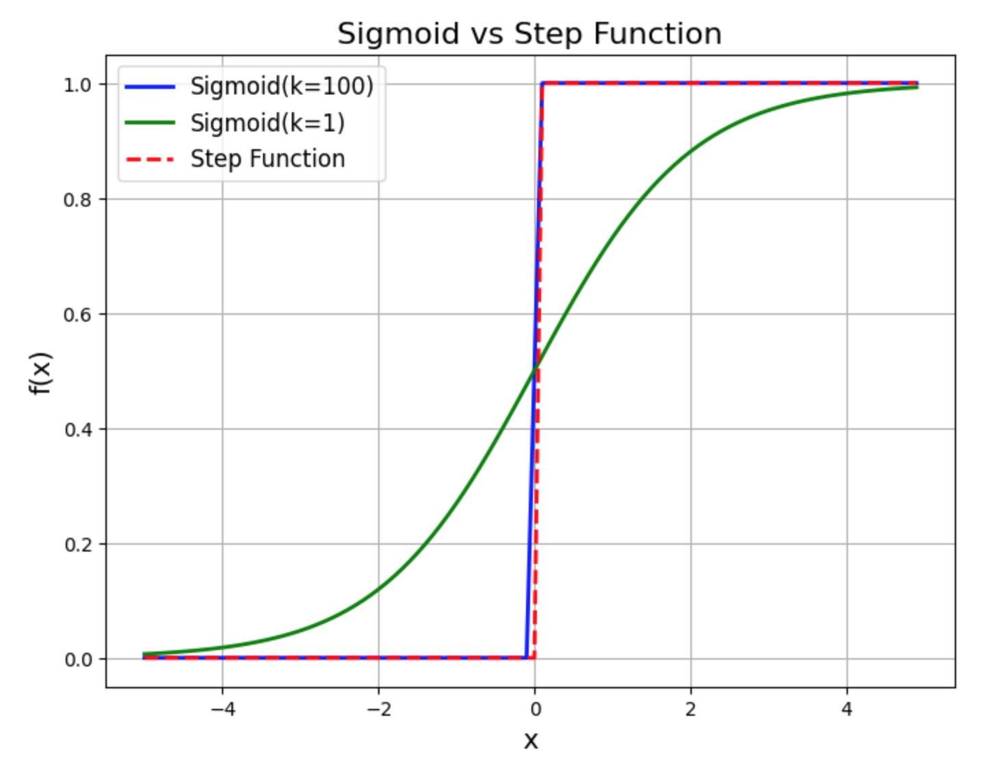
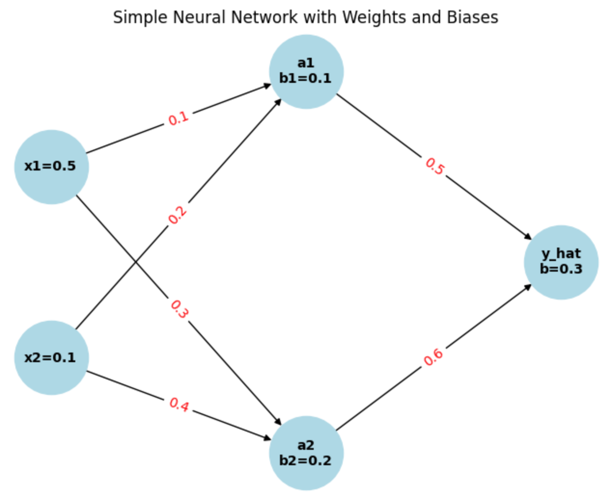

# 神经网络入门：从神经元到深度学习

神经网络是人工智能领域的核心技术之一，它在图像识别、自然语言处理、自动驾驶等任务中表现出色。本文将从最基本的神经元开始，逐步介绍神经网络的数学原理，并扩展到多层神经网络的复杂结构。阅读本文需要有一定的神经网络的基础，如果你第一次接触神经网络，需要先阅读相关的书籍。神经网络可以认为是一种新的编程模型，过去的编程模型，都需要我们告诉cpu具体的指令，但是，对某些任务，比如识别手写体这样的任务，很难用规则告诉计算机程序如何去识别手写体的规律，这个时候，我们需要一种新的编程模型，这种编程模型，能从数据中自动学习到规律，形成一个模型，然后通过这个模型，就可以实现手写体的识别。 

---

## 1. 神经元：神经网络的基本单元

### 什么是神经元？

神经元是神经网络的基本单元，它模仿了生物神经元的工作方式。一个神经元接收输入信号，经过处理后产生输出信号。

### 神经元的数学表示

一个典型的神经元可以表示为以下数学运算：

1. **线性变换**：  
   神经元接收输入 $x = [x_1, x_2, \ldots, x_n]$ ，并与权重 $w = [w_1, w_2, \ldots, w_n]$ 进行加权求和，再加上偏置 $b$：
   $$
   z = w_1 x_1 + w_2 x_2 + \ldots + w_n x_n + b
   $$
   用向量形式表示为：
   $$
   z = w^T x + b
   $$

2. **激活函数**：  
   线性变换的结果 $z$ 通过激活函数 $f$ 进行非线性变换，得到神经元的输出：
   $$
   a = f(z)
   $$
   常用的激活函数包括 Sigmoid、ReLU 和 Tanh。

简单的说，一个神经元，他会有很多触手，这些触手会对应输入，当然每个输入都会有一个权重，权重就是要训练的神经网络的内容，训练好了之后，你可以认为神经网络是一个n维的直线，他的斜率就是权重，截距就是偏置。当然，如果全部是线性的函数，神经网络就无法表达非线性的现象，功能就非常有限，这也是为什么需要一个激活函数的原因，激活函数对神经网络进行了非线性的变换，大大增强了他的表达能力。对于神经元的表达能力，以及为什么这样设计超出本文的范围。

---

## 2. 多个神经元：从单层到多层

### 单个神经的表达能力

我们设计神经网络就是为了能够解决问题，我们看看单个神经元 能解决什么问题。这是一个经典的问题，本周末你所在的城市有个奶酪节，你正好喜欢吃奶酪，考虑是否去看看。可以通过给以下3个因素设置权重来做出决定。

(1) 天气如何？

(2) 你的男朋友或女朋友会不会陪你去？

(3) 庆祝地点是否靠近公共交通站点？（假设你自己没有车。）

可以把这3个因素分别表示为二进制变量 $[x_1,x_2,x_3]$.

如果天气好，则 $x_1=1$ ；如果天气不好，则 $x_1=0$ 。类似地，如果你的男朋友或女朋友同去，$x_2=1$，否则 $x_2=0$ 。同理，$x_3=1$ 表示有公交车,否则没有公交车就是 $x_3=0$ 。
这是一个很简单的决策问题，一个决策会有各种因素影响，每种因素都会有一个权重，不同的人进行决策，权重会不同，单个神经元就可以进行这样的决策。

设置权重： $w=[6,2,2]$

设置输入： $x=[1,0,0]$

设置偏置： $b=1$

那么最终神经元的线性变换：$z = w^T x + b = 7$

我们设置这样的一个激活函数:

$$
f(x) = \begin{cases} 
1 & \text{if } x > 5 \\
0 & \text{if } x \leq 5 
\end{cases}
$$

1 表示我们去参加活动，0表示我们不去参加活动。通过一个神经元，我们就可以进行简单的决策。

刚刚我们设置的函数，不是一个连续函数，不利于进行求导数和微分运算。我们知道，要优化一个系统，如果函数是连续的，那么，我们就可以通过梯度下降法找到极值。这种阶跃函数，我们可以用sigmoid 函数来近似表示：

$$
f(x) = \lim_{k \to \infty} \frac{1}{1 + e^{-k(x-5)}}
$$

下面图形可以看出sigmoid 函数和 阶跃函数的关系:

当 k=100 的时候，基本上和阶跃函数一致了。

单个神经元就可以模拟多因素多决策，下面我们看看单层神经网络的表达能力。

### 单层神经网络

当多个神经元组合在一起时，就形成了单层神经网络。假设有 $m$ 个神经元，每个神经元的输出为：
$$
a_j = f(z_j) = f(w_j^T x + b_j), \quad j = 1, 2, \ldots, m
$$
将所有神经元的输出组合成一个向量：
$$
a = [a_1, a_2, \ldots, a_m]
$$

### 矩阵表示

用矩阵形式表示单层神经网络的运算：
$$
z = W x + b
$$
其中：

- $W$ 是权重矩阵，每一行对应一个神经元的权重，
- $b$ 是偏置向量，
- $z$ 是线性变换结果，
- $a = f(z)$ 是激活输出。

### 单层神经网络vs单个神经元

目前看来，单层的神经网络就是多个神经元的组合，也就是如果单个神经元的输出是一个数字，那么多个神经元的输出就是一个向量。
权重矩阵的每一行都对应一个神经元的权重，这样，多个神经元的输入输出可以用一个线性变换来表示。单层的神经网络的表达能力也非常有限，真正让神经网络大放异彩的是多层的神经网络。

---

## 3. 多层神经网络：深度学习的核心

### 什么是多层神经网络？

多层神经网络由多个单层神经网络堆叠而成，每一层的输出作为下一层的输入。这种结构可以学习更复杂的特征。

### 前向传播

假设神经网络有 $L$ 层，第 $l$ 层的计算步骤如下：

1. 线性变换：
   $$
   z^{(l)} = W^{(l)} a^{(l-1)} + b^{(l)}
   $$
2. 激活函数：
   $$
   a^{(l)} = f(z^{(l)})
   $$
   其中，$a^{(0)} = x$ 是输入数据。

### 多层神经网络的本质

向前传播实际上本质是层与层之间的一个迭代过程，这个过程因为激活函数的原因，他是非线性的。所以，这是一个非线性的迭代过程，这种迭代可以演化出非常复杂的系统。

### 深度学习的优势

多层神经网络通过逐层提取特征，可以学习到数据中的高阶模式。例如：

- 第一层可能学习边缘特征，
- 第二层可能学习形状特征，
- 更深层可能学习更复杂的语义特征。

深度学习最大的问题是学习难度比较大，因为每一层都是一个矩阵，多个层实际上是一个张量，我们要学习的参数就是这个张量的值。

---

## 4. 训练神经网络：反向传播算法

### 损失函数

神经网络的训练目标是最小化损失函数 $L$，它衡量模型预测值与真实值之间的差距。常见的损失函数包括均方误差和交叉熵。深度神经网络向前传播到目标输出到路径很长，所以，损失函数的改变来调整第一层，实际上效率会很低，所以要找到一种方法，从最后一层来调整，直到调整到第一层，这个就是反向传播到方法，而反向传播的本质是偏导数的链式结构。

### 导数的链式结构

复合函数求导的本质是**链式法则（Chain Rule）**，它是微积分中用于计算复合函数导数的核心工具。链式法则揭示了复合函数导数与其组成函数导数之间的关系，是深度学习中反向传播算法的基础。

---

#### 1. **复合函数的定义**

复合函数是由多个函数嵌套而成的函数。例如，给定两个函数 $y = f(u)$ 和 $u = g(x)$，它们的复合函数为：
$$
y = f(g(x))
$$

---

#### 2. **链式法则的数学形式**

链式法则指出，复合函数的导数可以通过以下方式计算：
$$
\frac{dy}{dx} = \frac{dy}{du} \cdot \frac{du}{dx}
$$

其中：

- $\frac{dy}{du}$ 是外层函数 $f$ 对中间变量 $u$ 的导数.
- $\frac{du}{dx}$ 是内层函数 $g$ 对输入 $x$ 的导数。

---

#### 3. **链式法则的本质**

链式法则的本质是**将复杂函数的求导问题分解为简单函数的求导问题**。具体来说：

1. **分解函数**：将复合函数分解为多个简单函数的组合。
2. **逐层求导**：对每一层函数分别求导。
3. **乘积连接**：将各层导数通过乘积连接起来，得到最终的导数。

---

#### 4. **链式法则的直观理解**

链式法则可以直观地理解为**变化率的传递**：

- 当 $x$ 变化时，$u = g(x)$ 会随之变化，变化率为 $\frac{du}{dx}$。
- 当 $u$ 变化时，$y = f(u)$ 会随之变化，变化率为 $\frac{dy}{du}$。
- 因此，$x$ 的变化通过 $u$ 传递到 $y$，总变化率为 $\frac{dy}{dx} = \frac{dy}{du} \cdot \frac{du}{dx}$。

简单的说，一个嵌套结构的函数，可以变成一个乘法结构的导数的积，这意味着一个递归的函数，他的导数可以变成一个乘法形式，变成了一个不嵌套的函数。这种性质意味着，函数的变化率符合乘法法则。

---

#### 5. **链式法则的推广**

链式法则可以推广到多元函数和高维情况。例如，对于多元复合函数：
$$
z = f(x, y), \quad x = g(t,s), \quad y = h(t,s)
$$
其导数为：
$$
\frac{dz}{dt} = \frac{\partial z}{\partial x} \cdot \frac{\partial x}{\partial t} + \frac{\partial z}{\partial y} \cdot \frac{\partial y}{\partial t}
$$

在多元的情况下，导数变成了一个乘法法则和加法法则的组合。也就是说，一个多元复合函数的变化率，等于每个复合函数变化率的和。

---

#### 6. **链式法则在深度学习中的应用**

在深度学习中，链式法则是反向传播算法的核心。神经网络的损失函数 $L$ 是多个复合函数的嵌套，其梯度计算如下：

1. **前向传播**：计算每一层的输出。
2. **反向传播**：从输出层开始，逐层计算损失函数对每一层参数的梯度。
3. **链式法则**：将梯度从后向前传递，通过链式法则计算每一层的梯度。

例如，对于神经网络中的某一层：
$$
\frac{\partial L}{\partial W} = \frac{\partial L}{\partial z} \cdot \frac{\partial z}{\partial W}
$$
其中：

- $\frac{\partial L}{\partial z}$ 是损失函数对输出的梯度，
- $\frac{\partial z}{\partial W}$ 是输出对权重的梯度。

---

#### 7. **总结**

复合函数求导的本质是链式法则，它通过将复杂函数的求导问题分解为简单函数的求导问题，实现了变化率的传递。链式法则不仅是微积分中的重要工具，也是深度学习中反向传播算法的基础。理解链式法则的本质，对于掌握神经网络和深度学习至关重要。

### 反向传播

反向传播算法用于计算损失函数对每个参数的梯度，具体步骤如下：

1. **前向传播**：计算每一层的输出和损失函数。向前传播是一个递归计算,他需要两步完成。

    线性变换：
   $$
   z^{(l)} = W^{(l)} a^{(l-1)} + b^{(l)}
   $$

    激活函数：
   $$
   a^{(l)} = f(z^{(l)})
   $$
   其中，$a^{(0)} = x$ 是输入数据。

2. **计算输出层误差**：
   $$
   \delta^{(L)} = \frac{\partial L}{\partial z^{(L)}}
   $$

   注意，这里的 z 是一个向量，所以  $\delta^{(L)}$, 也是一个向量，需要对向量的每个分量求导数。还有一个问题是，这个输出层误差为什么用 z 而不是用 a。这个其实和后面我们真正要求的梯度有关，我们实际要计算的就是:

    $$
    \frac{\partial L}{\partial W^{(l)}}
    $$

    $$
    \frac{\partial L}{\partial b^{(l)}}
    $$

    我们要通过求解 权重矩阵的梯度来修正权重矩阵，同时通过求解偏置的梯度来修正偏置。还有，W是一个矩阵，b 是一个向量，实际求解的偏导数非常多需要逐个元素求导。

    由于 $z = W x + b$，输出 $z$ 对权重矩阵 $W$ 的偏导数是一个三维张量（维度为 $m \times n \times m$）。为了简化计算，我们通常直接计算 $\frac{\partial L}{\partial W}$ 的每个元素。

    对于权重矩阵 $W$ 的第 $i$ 行第 $j$ 列元素 $W_{ij}$，其偏导数为：
    $$
    \frac{\partial L}{\partial W_{ij}}
    $$
  
3. **反向传播误差**：逐层计算误差：
   $$
   \delta^{(l)} = (W^{(l+1)})^T \delta^{(l+1)} \cdot f'(z^{(l)})
   $$
4. **计算梯度**：
   $$
   \frac{\partial L}{\partial W^{(l)}} = \delta^{(l)} (a^{(l-1)})^T
   $$
   $$
   \frac{\partial L}{\partial b^{(l)}} = \delta^{(l)}
   $$
5. **更新参数**：使用梯度下降法更新权重和偏置。

反向传播的具体推导，以及计算过程，这里忽略。但是，我们要指出这个算式的本质问题，那就是 $\delta^{(l)}$ 是依赖于 $\delta^{(l+1)}$ 的，我们知道，神经网络的计算是正向传播的，$z^{(l+1)}$ 是依赖 $z^{(l)}$ 的，为什么导数可以逆向的依赖呢？

### 从一个最简单的神经网络看反向传播

对于最一般的神经网络的讨论有点抽象，我们从一个最简单的神经网络开始讨论，这个神经网络就三层，一层输入，一层隐藏，一层输出

这个例子将帮助你更好地理解反向传播的每一步。

---

#### 1. **神经网络结构**

假设我们有一个三层神经网络：

- **输入层**：2 个神经元（输入 $x_1, x_2$）。
- **隐藏层**：2 个神经元（激活函数为 Sigmoid）。
- **输出层**：1 个神经元（激活函数为 Sigmoid）。

---

#### 2. **参数初始化**

假设网络的参数如下：
- 输入：$x = [x_1, x_2] = [0.5, 0.1]$
- 真实标签：$y_{\text{true}} = 1$
- 权重和偏置：
  - 输入层到隐藏层：
    $$
    W_1 = \begin{bmatrix} 0.1 & 0.2 \\ 0.3 & 0.4 \end{bmatrix}, \quad b_1 = \begin{bmatrix} 0.1 \\ 0.2 \end{bmatrix}
    $$
  - 隐藏层到输出层：
    $$
    W_2 = \begin{bmatrix} 0.5 & 0.6 \end{bmatrix}, \quad b_2 = [0.3]
    $$
---

#### 3. **前向传播**

##### **(1) 输入层到隐藏层**

1. 计算隐藏层的线性变换：
   $$
   z_1 = W_1 x + b_1 = \begin{bmatrix} 0.1 & 0.2 \\ 0.3 & 0.4 \end{bmatrix} \begin{bmatrix} 0.5 \\ 0.1 \end{bmatrix} + \begin{bmatrix} 0.1 \\ 0.2 \end{bmatrix} = \begin{bmatrix} 0.17 \\ 0.35 \end{bmatrix}
   $$
2. 应用 Sigmoid 激活函数：
   $$
   a_1 = \sigma(z_1) = \begin{bmatrix} \sigma(0.17) \\ \sigma(0.35) \end{bmatrix} = \begin{bmatrix} 0.542 \\ 0.586 \end{bmatrix}
   $$

我们发现，神经网络的计算步骤都可以用矩阵或者向量来做，这个对现代的cpu 和 GPU 非常友好，神经的网络的设计肯定是要考虑计算效率的。

##### **(2) 隐藏层到输出层**

1. 计算输出层的线性变换：
   $$
   z_2 = W_2 a_1 + b_2 = \begin{bmatrix} 0.5 & 0.6 \end{bmatrix} \begin{bmatrix} 0.542 \\ 0.586 \end{bmatrix} + 0.3 = 0.5 \times 0.542 + 0.6 \times 0.586 + 0.3 = 0.271 + 0.3516 + 0.3 = 0.9226
   $$
2. 应用 Sigmoid 激活函数：
   $$
   a_2 = \sigma(z_2) = \sigma(0.9226) = 0.715
   $$

##### **(3) 计算损失**

假设使用均方误差损失函数：
$$
L = \frac{1}{2} (a_2 - y_{\text{true}})^2 = \frac{1}{2} (0.715 - 1)^2 = 0.0406
$$

---

#### 4. **反向传播**

##### **(1) 计算输出层的误差**

1. 计算损失函数对输出层激活值的偏导数：
   $$
   \frac{\partial L}{\partial a_2} = a_2 - y_{\text{true}} = 0.715 - 1 = -0.285
   $$

   $L$ 为什么加了一个1/2，这里就很明显了，这样对输出层的导数就是 $a_2 - y_{true}$ 非常的简单明了。

2. 计算 Sigmoid 激活函数的导数：

    我们知道：$$\sigma'(x) = \sigma(x) \cdot (1 - \sigma(x))$$
    所以：
   $$
   \frac{\partial a_2}{\partial z_2} = a_2 (1 - a_2) = 0.715 \times (1 - 0.715) = 0.203
   $$
3. 计算输出层的误差：
   $$
   \delta_2 = \frac{\partial L}{\partial z_2} = \frac{\partial L}{\partial a_2} \cdot \frac{\partial a_2}{\partial z_2} = -0.285 \times 0.203 = -0.0579
   $$

这里隐含了 $L = f(a_2), a_2 = \sigma(z_2)$ 所以 $L=f(\sigma(z_2))$, 通过链式求导，就能求出输出层误差。是计算还可以不断的嵌套：

$$
   z_2 = W_2 a_1 + b_2
$$

$$
a_1 = \sigma(z_1)
$$

接下来计算:
$$
{\delta}_1 = \frac{\partial L}{\partial z_1} = \frac{\partial L}{\partial z_2} \cdot \frac{\partial z_2}{\partial z_1} = \frac{\partial L}{\partial z_2} \cdot \frac{\partial z_2}{\partial a_1} \cdot \frac{\partial a_1}{\partial z_1} = \delta_2 \cdot W_2 \cdot \sigma'(z1)
$$

这样我们就建立了 $\delta_1 和 \delta_2$ 之间的联系。这里我们要特别注意，求解 $\delta_1$ 实际上需要两步完成：

$$
{\delta}_{11} = \frac{\partial L}{\partial z_{11}} = \frac{\partial L}{\partial z_2} \cdot \frac{\partial z_2}{\partial z_{11}} = \frac{\partial L}{\partial z_2} \cdot \frac{\partial z_2}{\partial a_{11}} \cdot \frac{\partial a_{11}}{\partial z_{11}} = \delta_2 \cdot W_{21} \cdot \sigma'(z_{11})
$$

$$
{\delta}_{12} = \frac{\partial L}{\partial z_{12}} = \frac{\partial L}{\partial z_2} \cdot \frac{\partial z_2}{\partial z_{12}} = \frac{\partial L}{\partial z_2} \cdot \frac{\partial z_2}{\partial a_{12}} \cdot \frac{\partial a_{12}}{\partial z_1} = \delta_2 \cdot W_{22} \cdot \sigma'(z_{12})
$$

从上面的运算规律来看，可以认为是 $W_2$ 和 $\sigma'(z_1)$ 这两个向量的内积。这样，不需要一个一个的去计算，可以用向量的内积的方法来计算。接下来我们就实际计算一下隐藏层的误差。

##### **(2) 计算隐藏层的误差**

1. 计算隐藏层的误差，利用上面推导：
   $$
   \delta_1 = (W_2^T \delta_2) \cdot \sigma'(z_1)
   $$
   其中：
   - $W_2^T \delta_2 = \begin{bmatrix} 0.5 \\ 0.6 \end{bmatrix} \times -0.0579 = \begin{bmatrix} -0.02895 \\ -0.03474 \end{bmatrix}$
   - $\sigma'(z_1) = \begin{bmatrix} 0.542 \times (1 - 0.542) \\ 0.586 \times (1 - 0.586) \end{bmatrix} = \begin{bmatrix} 0.248 \\ 0.242 \end{bmatrix}$
   - 因此：
     $$
     \delta_1 = \begin{bmatrix} -0.02895 \\ -0.03474 \end{bmatrix} \cdot \begin{bmatrix} 0.248 \\ 0.242 \end{bmatrix} = \begin{bmatrix} -0.00718 \\ -0.00841 \end{bmatrix}
     $$

##### **(3) 计算梯度**

梯度的推导和上面类似，我们不重复推导了。关键的点在于:

$$
z_2 = W_2 a_1 + b_2 
$$

1. 计算隐藏层到输出层的梯度：
   $$
   \frac{\partial L}{\partial W_2} = \delta_2 \cdot a_1^T = -0.0579 \times \begin{bmatrix} 0.542 \\ 0.586 \end{bmatrix} = \begin{bmatrix} -0.0314 \\ -0.0339 \end{bmatrix}
   $$
   $$
   \frac{\partial L}{\partial b_2} = \delta_2 = -0.0579
   $$
2. 计算输入层到隐藏层的梯度：
   $$
   \frac{\partial L}{\partial W_1} = \delta_1 \cdot x^T = \begin{bmatrix} -0.00718 \\ -0.00841 \end{bmatrix} \times \begin{bmatrix} 0.5 & 0.1 \end{bmatrix} = \begin{bmatrix} -0.00359 & -0.000718 \\ -0.004205 & -0.000841 \end{bmatrix}
   $$
   $$
   \frac{\partial L}{\partial b_1} = \delta_1 = \begin{bmatrix} -0.00718 \\ -0.00841 \end{bmatrix}
   $$

---

#### 5. **更新参数**

假设学习率 $\eta = 0.1$，更新参数：
1. 更新 $W_2$ 和 $b_2$：
   $$
   W_2 \leftarrow W_2 - \eta \frac{\partial L}{\partial W_2} = \begin{bmatrix} 0.5 \\ 0.6 \end{bmatrix} - 0.1 \times \begin{bmatrix} -0.0314 \\ -0.0339 \end{bmatrix} = \begin{bmatrix} 0.50314 \\ 0.60339 \end{bmatrix}
   $$
   $$
   b_2 \leftarrow b_2 - \eta \frac{\partial L}{\partial b_2} = 0.3 - 0.1 \times (-0.0579) = 0.30579
   $$
2. 更新 $W_1$ 和 $b_1$：
   $$
   W_1 \leftarrow W_1 - \eta \frac{\partial L}{\partial W_1} = \begin{bmatrix} 0.1 & 0.2 \\ 0.3 & 0.4 \end{bmatrix} - 0.1 \times \begin{bmatrix} -0.00359 & -0.000718 \\ -0.004205 & -0.000841 \end{bmatrix} = \begin{bmatrix} 0.100359 & 0.2000718 \\ 0.3004205 & 0.4000841 \end{bmatrix}
   $$
   $$
   b_1 \leftarrow b_1 - \eta \frac{\partial L}{\partial b_1} = \begin{bmatrix} 0.1 \\ 0.2 \end{bmatrix} - 0.1 \times \begin{bmatrix} -0.00718 \\ -0.00841 \end{bmatrix} = \begin{bmatrix} 0.100718 \\ 0.200841 \end{bmatrix}
   $$

---

#### 6. **总结**

通过这个例子，我们详细演示了三层神经网络的前向传播和反向传播过程。反向传播通过链式法则逐层计算误差和梯度，最终更新网络参数。理解这个过程是掌握神经网络训练的关键！反向传播的核心在于 $\delta$ 在每一层的传播，以及通过 $\delta$ 很容易计算:

$$
\frac{\partial L}{\partial W}
$$

$$
\frac{\partial L}{\partial b}
$$

这个就是方向传播的核心思想

---

## 5. 总结

神经网络从简单的神经元出发，通过多个神经元的组合和多层堆叠，形成了强大的深度学习模型。它的核心在于前向传播和反向传播的数学运算，以及通过梯度下降法优化参数。随着计算能力的提升和数据量的增加，神经网络正在推动人工智能技术的飞速发展。

希望这篇文章能帮助你理解神经网络的基本原理！如果你对某个部分感兴趣，可以深入探索相关的数学细节和实际应用。
