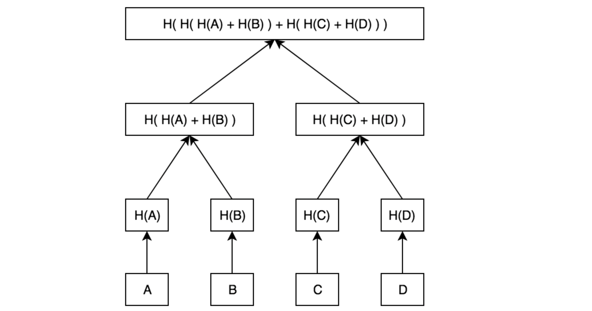
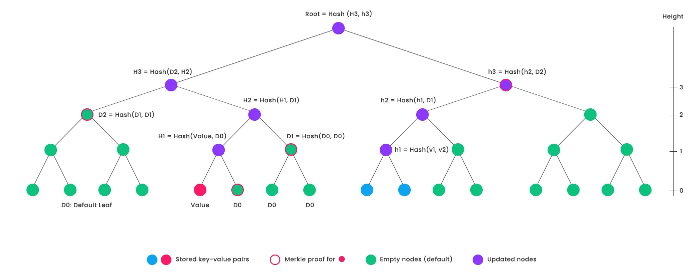

# 稀疏merkle树简介

## 介绍

在区块链中，在跨链交易中，经常会遇到需要证明另外一条链上的状态的情况。比如，我们需要证明用户的交易已经在以太坊上锁定，然后在自己的链上mint对应的代币，因为，我们没有在另外一条链上的状态数据，只能通过同步另外一条链上的头部信息来确定他的状态。
比如，通过以太坊的hash值，我们就能确定如下的状态:

1. 指定的交易是否在区块中
2. 指定的帐户的余额
3. 指定的某个状态值

以太坊上的mpt树的证明非常大，不是非常适合做跨链，而且不能做批量证明，这篇文章介绍一下稀疏merkle树，他具有非常优越的性能，证明大小在压缩后也和普通的merkle tree 小，比以太坊的证明要小一个量级。

## 普通merkle树

普通merkle 树就是简单的两两做hash, 然后hash到最终的 root

普通merkle树最大的问题就是无法进行更新操作。只能表示静态的数据，而不能表示动态的数据。另外只能表示存在性，表示不了不存在。稀疏merkle树就是为了解决这类问题的。

## 稀疏merkle树

稀疏merkle树是一个固定大小的merkle树，一般选取大小为 $2^{256}$, 这是一个非常大的数字，这也是这个名字的由来。数据会通过256位的hash确定树中唯一的位置，也就是说任意一个数据在树中的位置都是固定的。普通的merkle树是一个数组，所以插入新数据的时候需要移动数据，如果这个数据量是几十亿的量级，这个性能是非常低的。而稀疏merkle树没有这个问题，这样更新，添加树中的数据就变得非常的简单，这也是稀疏merkle树的核心优势。

下面是一个 $2^4$ 的稀疏merkle树:

这个树只有三个数据, 一般数据是key:value 数据对。比如，数据是: alice:100USDT, 表示alice 有100美金的资产。然后，alice 转移 20USDT给 bob, 这样会新产生两个数据, alice:80USDT, bob:20USDT 。 而原来的alice:100USDT 会被删除。只要alice:100USDT位置被证明是一个空值，那就说明帐户余额发生了改变。也就是说，稀疏merkle树还能证明某个数据不存在。

## 应用

稀疏merkle树在很多项目中被用来实现 状态树，比如lisk等项目。他在性能上，证明大小上都要比以太坊的mpt树更好。此外，比特币的 Taproot Assets 也用到了 稀疏merkle树， 还有以太坊的plasma 也用到了 稀疏merkle树。
